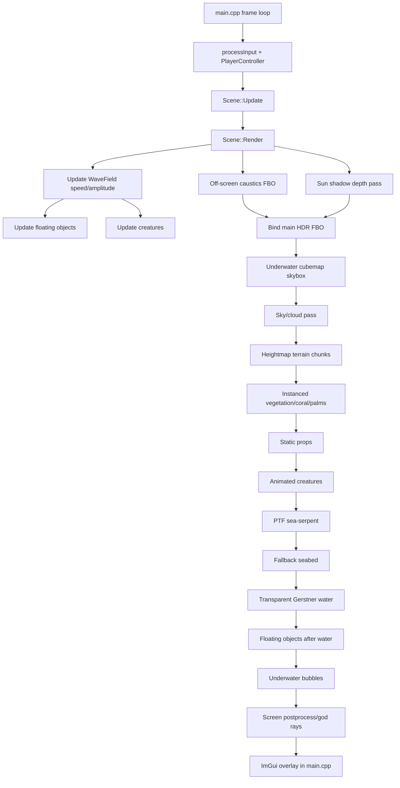
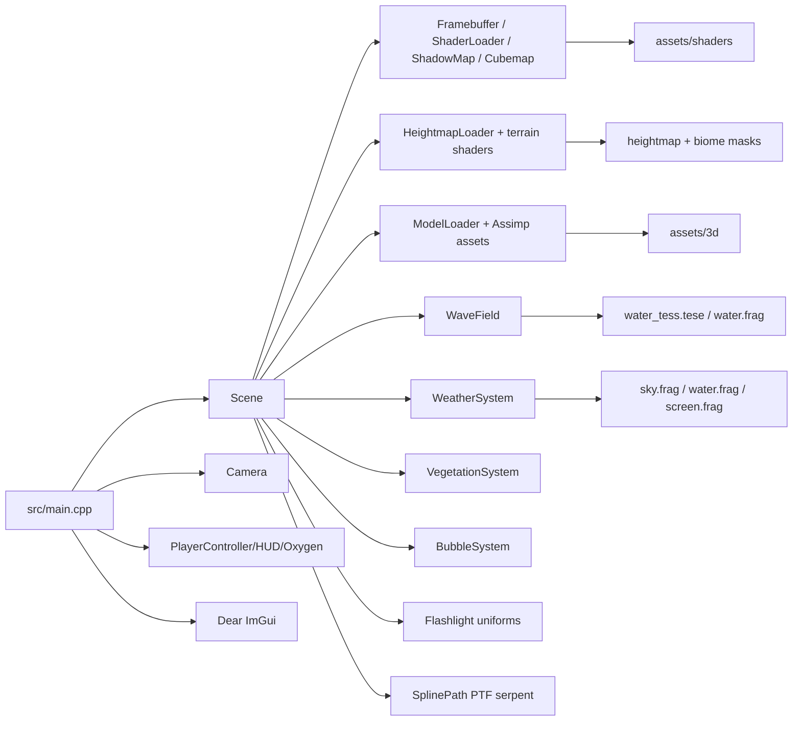

# Project Underworld Context Map

Captured on 2026-06-04 from `C:\Users\Mykyta\Desktop\grk\project_underworld`.
This file exists so future Codex sessions can start from a compact, durable map
instead of repeating a broad project scan.

## Summary

Project Underworld is a C++20/OpenGL 3.3 core underwater and surface-ocean
renderer. The app renders an island/underwater scene with Gerstner-wave water,
heightmap terrain, weather presets, volumetric sky/cloud/post effects, caustics,
shadow mapping, instanced vegetation, floating objects, creatures, bubbles,
player oxygen/flashlight systems, and an ImGui control panel.

The repository currently has no `.git` directory. Treat files on disk as the
source of truth.

## Build And Runtime

- `CMakeLists.txt` builds target `project_underworld`.
- CMake source list includes `src/main.cpp`, loaders, framebuffer/shader
  helpers, `Scene.cpp`, `VegetationSystem.cpp`, `BubbleSystem.cpp`, and vendored
  Dear ImGui sources.
- Dependencies are discovered via CMake packages first, with Windows fallback
  paths under `dependencies/` for GLEW, GLFW, GLM, and Assimp.
- Runtime output is set to the build root so relative `./assets` paths work.
- CMake post-build copies `assets/` next to the binary.
- Original Windows workflow can use `project_underworld.vcxproj`.
- There are generated/build folders such as `Debug/`, `project_.4bded449/`, and
  `__pycache__/`; avoid editing them.

Useful commands:

```powershell
cmake -S . -B build
cmake --build build --config Debug
python -m py_compile generate_heightmap.py
python tools/check_no_caves.py
```

## Existing Specs

`.kiro/specs/ocean-weather-overhaul/` contains `requirements.md`, `design.md`,
and `tasks.md`. The task list is marked complete and describes the recent
overhaul: cave removal, unified wave field, weather presets, islands, floating
objects, bubbles, water transparency, left-side control panel, and verification.

Important constraints from those specs:

- Stay on OpenGL 3.3 core.
- Preserve graded methods: normal mapping, PBR, quaternion camera, cubemap,
  Parallel Transport Frames, shadow mapping with PCF.
- Preserve selected techniques: instanced rendering + discrete LOD, and
  heightmap-based seabed/island terrain.
- Keep `generate_heightmap.py` and `HeightmapLoader` in sync if height encoding
  changes.
- Keep interactive frame rate and do not disable culling/LOD optimizations.

## Source Topology

```text
src/
  main.cpp
  core/
    HeightmapLoader.{h,cpp}
    ModelLoader.{h,cpp}
  render/
    Cubemap.h
    Framebuffer.{h,cpp}
    ShaderLoader.{h,cpp}
    ShadowMap.h
  scene/
    Scene.{h,cpp}
    WaveField.h
    Weather.h
    VegetationSystem.{h,cpp}
    BubbleSystem.{h,cpp}
    SplinePath.h
    FloatingObject.h
    PalmMesh.h
    Camera.h
  player/
    PlayerController.h
    PlayerHUD.h
    OxygenSystem.h
    Flashlight.h
    CameraShake.h
```

`Scene.cpp` is the largest file and central orchestrator. Start with `Scene.h`
and use `rg -n "Scene::FunctionName"` or line slices before reading large
sections.

## Module Responsibilities

- `src/main.cpp`: initializes GLFW/GLEW/OpenGL 3.3 core, sets callbacks, creates
  ImGui, owns global camera/input tuning variables, drives the loop, renders the
  control panel, and calls `Scene::Update` / `Scene::Render`.
- `Scene`: owns most GL objects, programs, textures, world state, render passes,
  terrain queries, props, creatures, vegetation, water, weather, shadows,
  caustics, and postprocessing.
- `ShaderLoader`: reads shader files, compiles, links, and prints compile/link
  errors to `std::cerr`.
- `Framebuffer`: creates an HDR color texture and depth texture for the main
  off-screen render pass.
- `ShadowMap`: owns a 2048-ish sun depth texture and light-space matrix used by
  terrain and spline shaders.
- `HeightmapLoader`: decodes world heightmap PNG and biome masks.
- `ModelLoader`: loads OBJ directly and other model formats through Assimp;
  supports multi-part/multi-material glTF workflows for props.
- `WaveField`: shared Gerstner wave definitions and CPU sampler; uniforms are
  uploaded to the water shader so floating objects and rendered water agree.
- `Scene::createShorelineDataTexture()`: uploads the collision height field as
  `RG32F` terrain height + valid mask for dynamic water shore foam.
- `WeatherSystem`: presets and smooth active values for water color, cloud
  density/color, exposure, saturation, contrast, fog, and wave amplitude.
- `VegetationSystem`: builds/loads LOD meshes, scatters instances on terrain,
  renders via `glDrawElementsInstanced`, and tracks per-frame stats for ImGui.
- `BubbleSystem`: OpenGL 3.3 point-sprite bubbles, active only underwater.
- `player/*`: movement, oxygen, flashlight uniforms, HUD, and camera motion.

## Shader Inventory

Shader pairs and responsibilities:

- `water_tess.{vert,tesc,tese}` + `water.frag`: Gerstner water surface
  (tessellated — real polygons on crests), crest foam, terrain-derived
  shore/contact foam, transparency, above/below water branches,
  HDRI/cloud reflection/refraction behavior.
- `terrain.vert` + `terrain.frag`: heightmap terrain, biome masks, PBR-style
  material blending, triplanar/normal mapping, caustics and PCF shadows.
- `object.vert` + `object.frag`: props, floating boats/buoys, creatures, normal
  maps, object lighting, shadows, flashlight.
- `vegetation.vert` + `vegetation.frag`: instanced vegetation/coral/palms with
  sway, alpha behavior, and LOD buckets.
- `spline.vert` + `spline.frag`: PTF sea-serpent render path.
- `sky.vert` + `sky.frag`: background sky/cloud pass.
- `skybox.vert` + `skybox.frag`: cubemap underwater background.
- `caustics.vert` + `caustics.frag`: render-to-texture caustics.
- `depth.vert` + `depth.frag`: shadow depth pass.
- `screen.vert` + `screen.frag`: postprocess, god rays, tonemapping/color grade.
- `bubbles.vert` + `bubbles.frag`: underwater bubble particles.
- `seabed.vert` + `seabed.frag`: fallback flat seabed.
- `flashlight.glsl`: shared flashlight helper included by fragment shaders.

When changing shader uniforms, update both C++ upload code and GLSL names in the
same change.

## Asset Map

- `assets/shaders/`: all GLSL shader files.
- `assets/textures/water_normal.jpg`, `assets/textures/sky_hdri.hdr`: global
  water/sky textures.
- `assets/textures/world/T_World_Heightmap.png`: terrain heightmap.
- `assets/textures/world/M_{Castle,Lava,River}_Depth_Mask.png`: biome masks.
- `assets/textures/world/terrain/*`: PBR-ish terrain texture sets.
- `assets/3d/`: props, rocks, boats, animals, palms, vegetation, and textures.
- `external/imgui/`: vendored Dear ImGui. Usually do not inspect examples.
- `external/stb_image.h`, `external/tinyexr.h`: vendored single-header libs.

Some paths in `Scene.cpp` intentionally try optional art assets and then fall
back to procedural or alternate meshes. Check file existence before assuming an
asset load failure is a code bug.

## Render Frame Graph



## Dependency Graph



## Common Workflows

### Rendering Bug

1. Identify pass: skybox, sky, terrain, vegetation, props, creatures, serpent,
   seabed, water, floating objects, bubbles, caustics, shadow, or postprocess.
2. Check `ShaderLoader` output for compile/link errors.
3. Check shader creation in `Scene::Init`.
4. Check uniform names and texture units.
5. Check VAO attributes and index counts.
6. Check GL state restore after the previous pass.
7. For black/white/missing model textures, inspect `ModelLoader`, `PropSub`, and
   `loadTextureCached` behavior.

### Water Or Buoyancy Mismatch

Start with `WaveField.h`, `water_tess.tese`, `Scene::Render`, and
`Scene::updateFloatingObjects`. The CPU wave sampler and GPU wave shader should
share the same component definitions and speed/amplitude inputs.

### Terrain Or Heightmap Change

Touch these together when changing encoding or masks:

- `generate_heightmap.py`
- `src/core/HeightmapLoader.{h,cpp}`
- `assets/textures/world/T_World_Heightmap.png`
- `assets/textures/world/M_*_Depth_Mask.png`
- `terrain.vert` / `terrain.frag` if world-height semantics change

Run `python -m py_compile generate_heightmap.py` and, when relevant, regenerate
or inspect the heightmap outputs.

### Performance Work

Start with existing stats in the ImGui panel:

- FPS / frame ms
- coral LOD buckets and stochastic pruning
- terrain chunks drawn/total

Likely hot spots: `Scene.cpp` terrain chunk draws, high-res terrain/material
textures, `VegetationSystem::render` instance buffer updates, caustics texture
size, water shader complexity, `screen.frag` postprocess, and expensive model
draws with many submeshes/material binds.

## Known Risk Areas

- `Scene.cpp` is monolithic, so broad changes can create accidental regressions.
- Many render passes rely on GL state ordering; save/restore state when adding a
  pass.
- Texture unit usage in terrain reaches high indices; avoid collisions.
- Runtime paths are relative to the executable working directory and `assets/`.
- Visual correctness often requires running the app; compile success is not
  enough.
- README and some source comments show mojibake in a few places; keep new text
  ASCII/English unless there is a strong reason otherwise.
